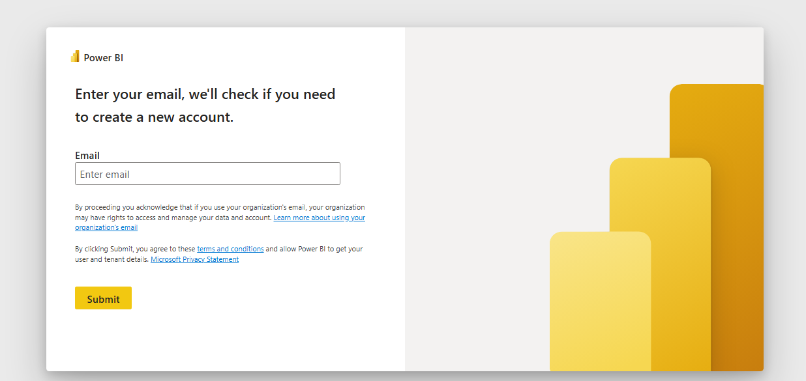
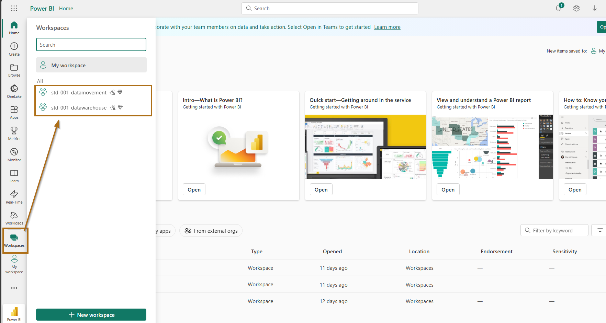

# How to Access Power BI

1. Open your browser and go to [https://app.powerbi.com](https://app.powerbi.com).
2. Log in using your credentials.
    

Once you are inside, you will see the two workspaces where you will create the different items in our upcoming exercises.

.png)