# Exercise 5 - Creating a Dataflow Gen2 for Date Dimension and Publishing to the Gold Layer

In this exercise, you will:
1. Create a **Dataflow Gen2** in Microsoft Fabric within the **Analytics Workspace**.
2. Use a **blank query** to generate a comprehensive date dimension.
3. Publish the resulting data as a table into the **wh_datawarehouse (Gold Layer)** for advanced analytics and reporting.

**Duration:** 30 minutes

---

## **Objectives**
- Learn to create and configure a Dataflow Gen2 in Fabric.
- Use M code (Power Query) to generate a fully-featured date dimension.
- Publish a Dataflow Gen2 output table to the Gold Layer, highlighting the benefits of this approach.

---

## **Pre-requisites**
1. Ensure you have a **wh_datawarehouse** provisioned in your Fabric Analytics Workspace.
2. Have permissions to create and publish Dataflow Gen2 outputs in Fabric.
3. Familiarise yourself with Power Query and M code basics (optional).

---

## **Step 1 - Create a Dataflow Gen2**

1. Navigate to the **Analytics Workspace** in **Microsoft Fabric**.
2. Select **New Item.

   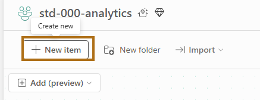

3. Click **+ New** and select **Dataflow Gen2**.

    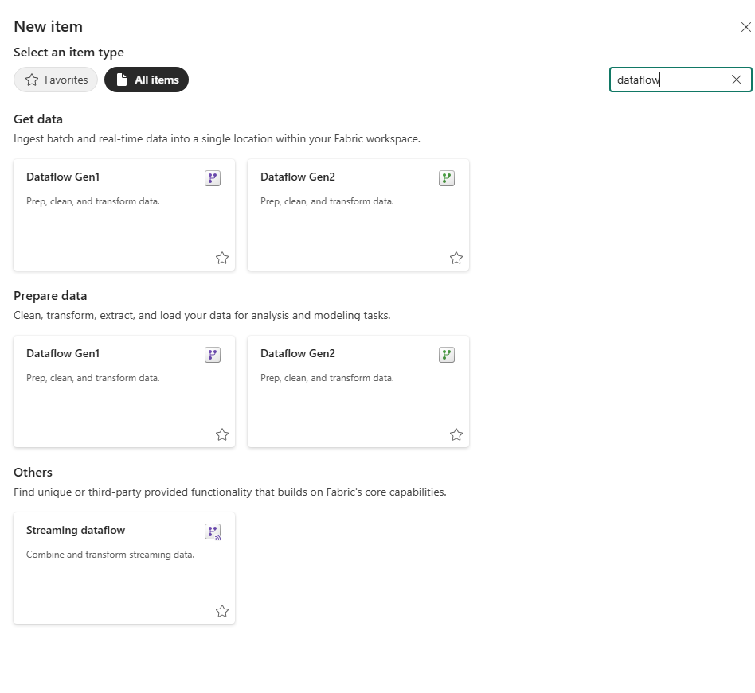

4. Name the Dataflow Gen2 (e.g., `df_createdatedimension`).
      
      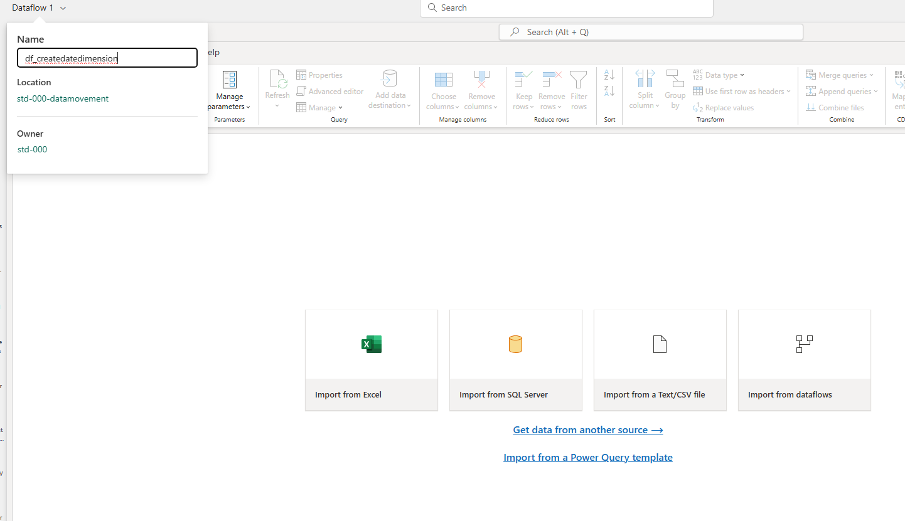
---

## **Step 2 - Add a Blank Query to Generate the Date Dimension**

1. In the Dataflow Gen2 interface, click ** Get Data** and choose **Blank Query**.

    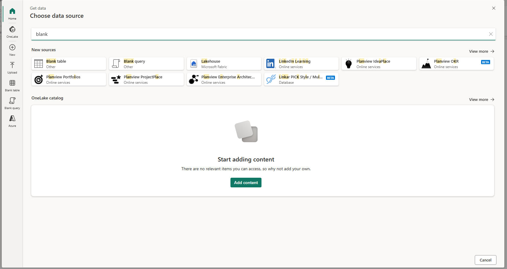

2. Replace the default query text with the following M code:

    ```powerquery
    let
        // configurations start
        Today = Date.From(DateTime.LocalNow()), 
        FromYear = 2011, 
        ToYear = 2015, 
        StartofFiscalYear = 7, 
        firstDayofWeek = Day.Monday, 
        // configuration end
        FromDate = #date(FromYear, 1, 1),
        ToDate = #date(ToYear, 12, 31),
        Source = List.Dates(
            FromDate,
            Duration.Days(ToDate - FromDate) + 1,
            #duration(1, 0, 0, 0)
        ),
        #"Converted to Table" = Table.FromList(Source, Splitter.SplitByNothing(), null, null, ExtraValues.Error),
        #"Renamed Columns" = Table.RenameColumns(#"Converted to Table", {{"Column1", "Date"}}),
        #"Changed Type" = Table.TransformColumnTypes(#"Renamed Columns", {{"Date", type date}}),
        #"Inserted Year" = Table.AddColumn(#"Changed Type", "Year", each Date.Year([Date]), Int64.Type),
        #"Inserted Month Name" = Table.AddColumn(#"Inserted Year", "Month Name", each Date.MonthName([Date]), type text),
        #"Inserted Quarter" = Table.AddColumn(#"Inserted Month Name", "Quarter", each Date.QuarterOfYear([Date]), Int64.Type),
        #"Added Custom Year-Month" = Table.AddColumn(#"Inserted Quarter", "Year-Month", each Date.ToText([Date], "MMM yyyy")),
        #"Changed Type for Year-Month" = Table.TransformColumnTypes(#"Added Custom Year-Month", {{"Year-Month", type text}})
    in
        #"Changed Type for Year-Month"
    ```

    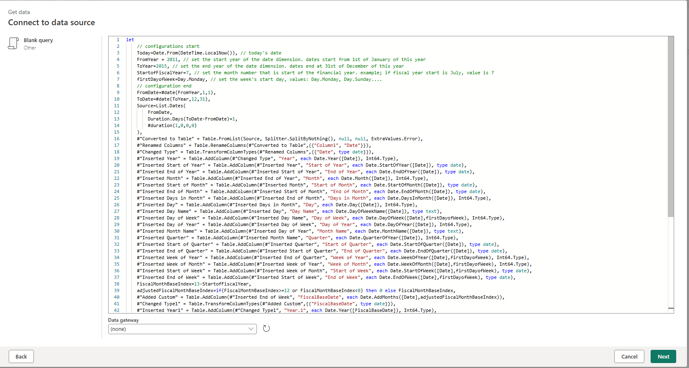

3. Click **Next** to preview the query results. Verify that the table includes all required 

4. Change the table name to Date

    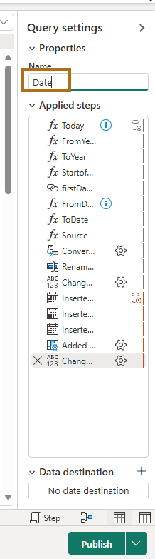
---

## **Step 3 - Configure Output for the Gold Layer**

1. On the **Output Settings** page:
   - Choose **Publish to Warehouse** as the destination.
   
      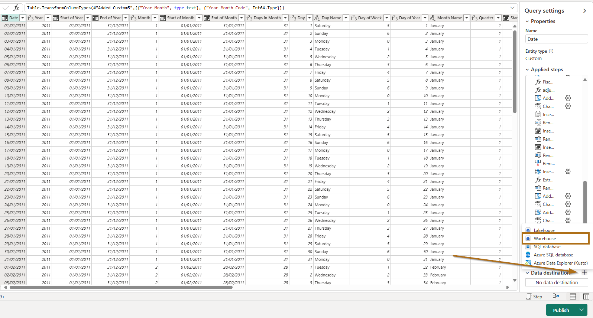
   
   - Select your **wh_datawarehouse** from the list and provide a name for the table (e.g., `Date`).
   
      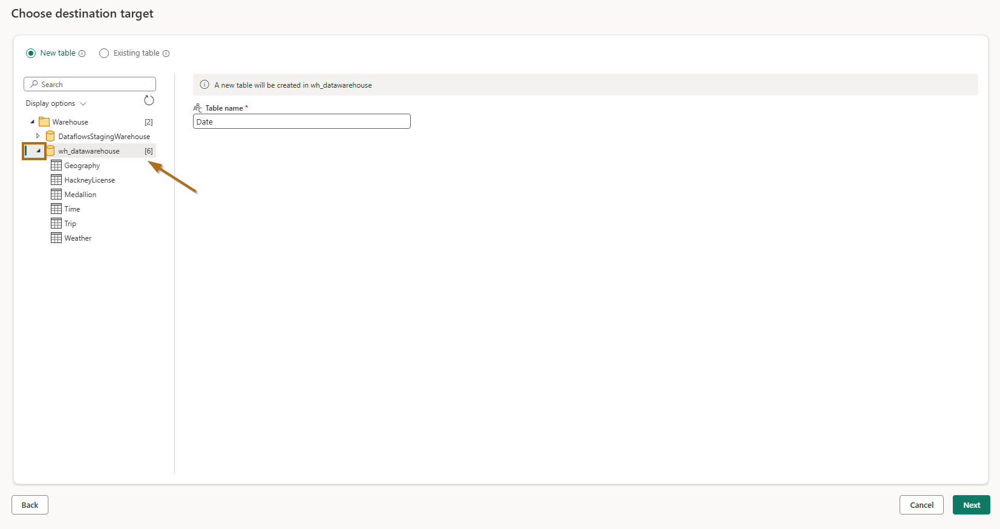
   
   
   - Choose destination settings
      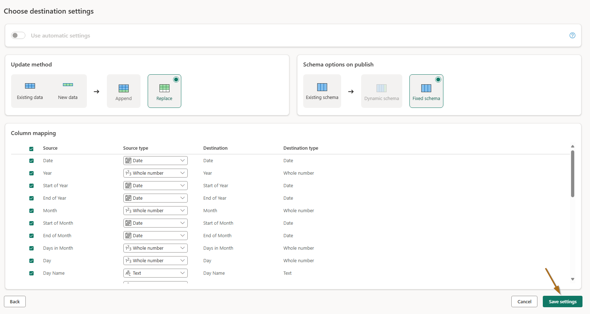
    

2. Then **Publish ** to apply changes.

    
    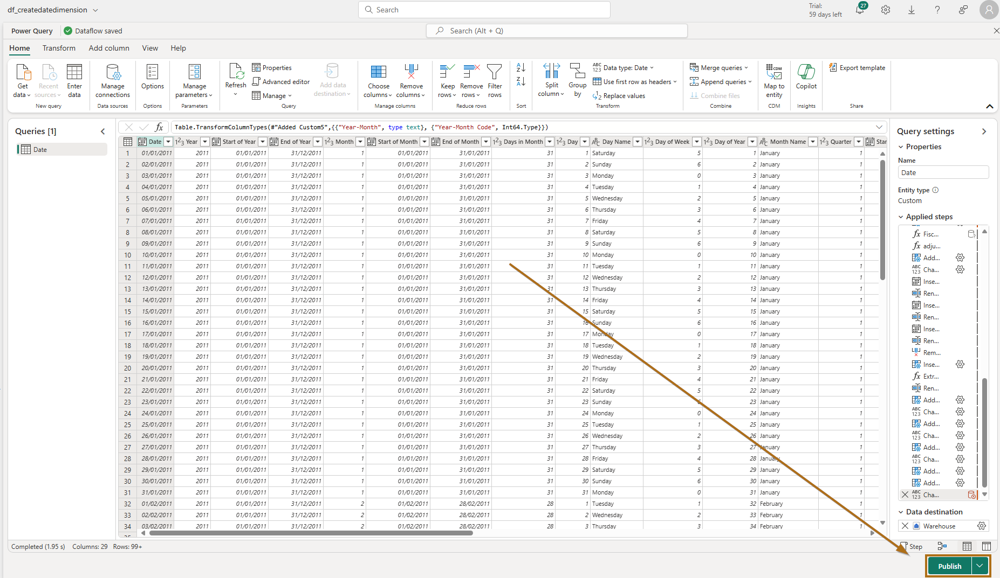

    **The refresh of the dataflow is going to take a few minutes.**

    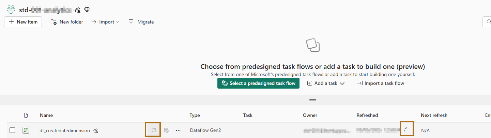
---

## **Step 4 - Validation**

1. Navigate to the **wh_datawarehouse** .
2. Open the SQL endpoint or use the Warehouse UI to query the `Date` table.

    ```sql
    SELECT TOP 10 * FROM dbo.Date;
    ```

3. Verify that the data matches the expected structure and content.

   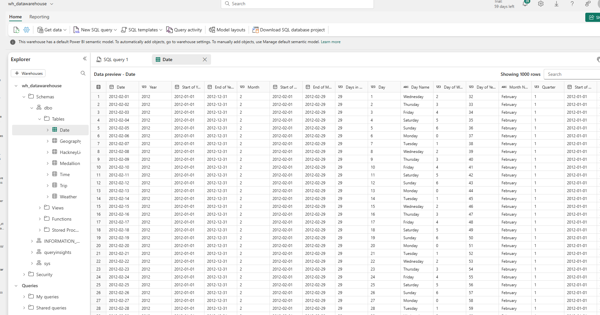

---

## **Benefits of Dataflow Gen2**

### **Simplified Data Transformation**
- Automates data preparation with a no-code or low-code interface.
- Supports advanced transformations directly in Power Query M.

### **Reusable Logic**
- Centralises reusable transformations, reducing redundancy and improving consistency.

### **Integration with Microsoft Fabric**
- Seamlessly integrates with other Fabric components, such as Lakehouses and Warehouses.
- Outputs can be published directly to the Gold Layer, ensuring high-quality data for reporting.

### **Scalability**
- Optimised for large-scale transformations with better performance compared to traditional dataflows.

---

## **Summary**

You have successfully:
1. Created a **Dataflow Gen2** to generate a comprehensive date dimension.
2. Published the resulting data into the **wh_datawarehouse (Gold Layer)** for advanced analytics.
3. Validated the output, ensuring readiness for use in Power BI and other reporting tools.

This exercise demonstrates how Dataflow Gen2 simplifies and streamlines data preparation in **Microsoft Fabric**.
