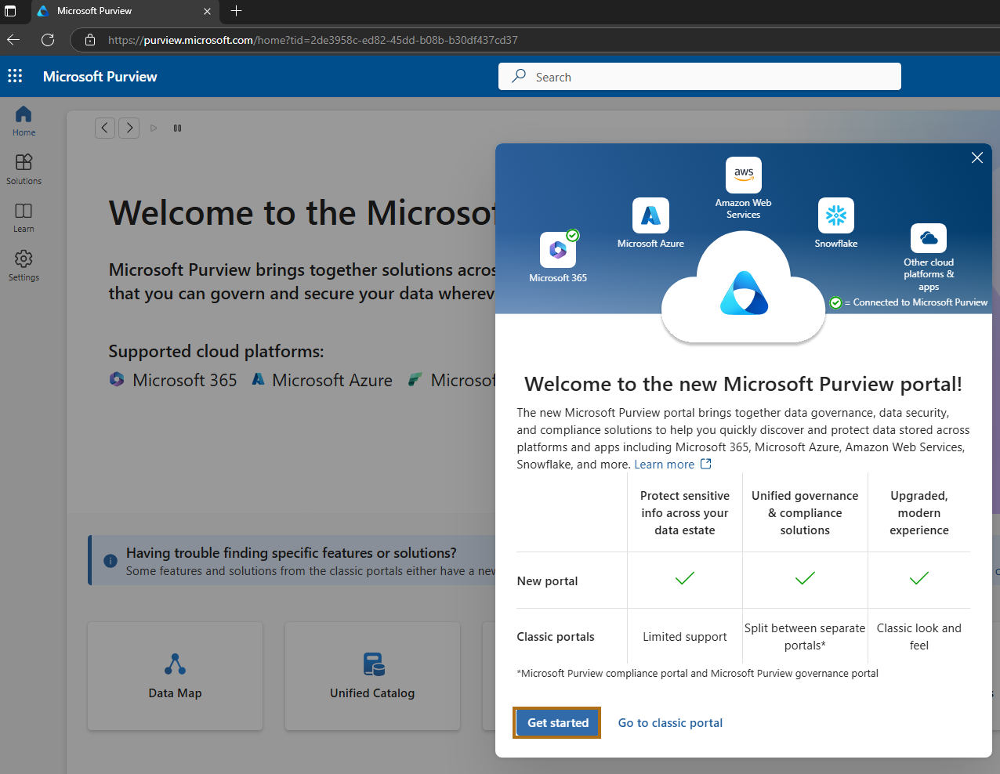
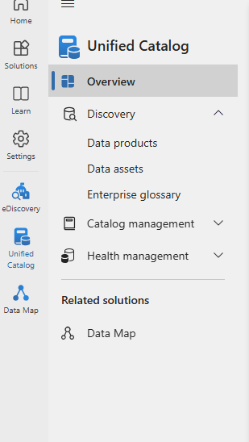
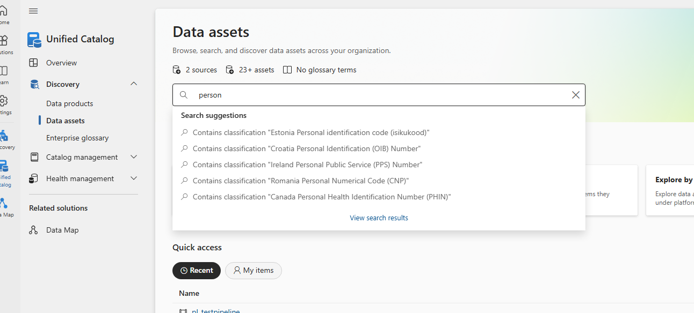

# Exercise 1 – Browse and Search the Data Catalog in Microsoft Purview

In this exercise, you will explore Microsoft Purview’s Data Catalog to locate and review metadata for sample data assets. This is an essential step for understanding how data is classified, governed, and discovered in a modern data estate.

**Duration:** 15 minutes

---

## Objectives

- Learn how to navigate the Microsoft Purview portal.
- Use search and filter capabilities to locate data assets.
- Understand how metadata and classifications are displayed.

---

## Pre-requisites

Ensure you have the following:

1. Access to the [Microsoft Purview Portal](https://purview.microsoft.com)
2. At least one data source registered with assets scanned.
3. Viewer or Data Curator permissions in Purview.

---

## Step 1 – Open Microsoft Purview Portal

1. Go to [https://purview.microsoft.com](https://purview.microsoft.com)

   

2. Sign in with your organizational credentials.
3. From the left-hand menu, click **Unified Catalog** → **Browse assets**.

   
---

## Step 2 – Use the Search Feature

1. In the **Search bar**, type a keyword such as `Person`.
2. Press **Enter**.
3. Review the list of results.

   
---

## Step 3 – Apply Filters

1. On the left-hand side, apply filters to narrow results:
   - **Asset Type**: Table, File, Power BI Dataset, etc.
   - **Data Source**: Select a known source.
   - **Classification**: E.g., “Confidential”, “Email Address”.

> Example Screenshot Placeholder: ``

2. Click on a search result to view its metadata.

---

## Step 4 – Explore Metadata and Classifications

1. On the asset detail page, review:
   - **Description** and **Owner**
   - **Schema** (column names and types)
   - **Classifications**
   - **Glossary terms**

> Example Screenshot Placeholder: ``

---

## Step 5 – Record Key Observations

Fill in the table below based on the asset you selected:

| **Field**               | **Example Value**      |
|------------------------|------------------------|
| Asset Name             | customer_data          |
| Asset Type             | Table                  |
| Classification Applied | Email Address          |
| Glossary Term Linked   | Customer ID            |

---

## Summary

In this exercise, you:

- Navigated the Microsoft Purview portal.
- Searched and filtered data assets.
- Reviewed metadata, classifications, and glossary terms.
