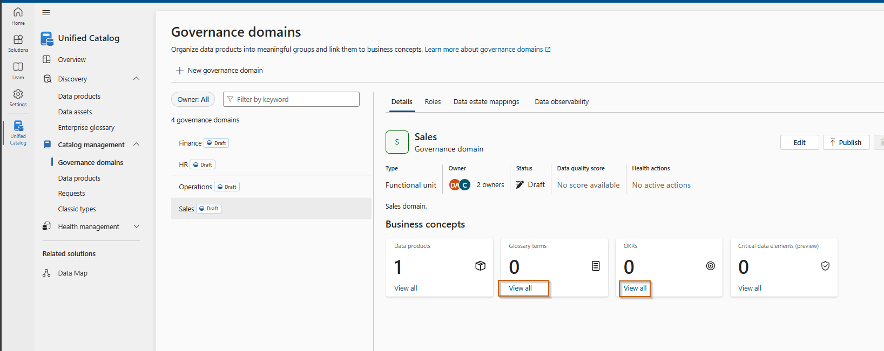

# Exercise – Create a Data Product in Microsoft Purview

In this exercise, you will create a data product using Microsoft Purview's Unified Data Catalog. This involves grouping related data assets under a shared governance domain, enriching them with business context, and publishing them for organizational discovery and access.

**Duration:** 30–45 minutes

---

## Objectives

- Understand and define governance domains.
- Create a data product in Microsoft Purview.
- Add and organize relevant data assets.
- Enhance the product with glossary terms and metadata.
- Publish the data product for discovery and access.

---

## Pre-requisites

Ensure the following are available before beginning:

- Access to the [Microsoft Purview Portal](https://purview.microsoft.com)
- Data Product Owner role or equivalent permissions
- At least one scanned data source (e.g., Azure SQL DB, ADLS)
- Optional: Predefined glossary terms and classifications

---

## Step 1 – Create a Governance Domain

1. Open the Microsoft Purview portal.
2. Navigate to **Solutions** →**Unified Catalog** → **Governance domains**.
3. Click **+ New Governance domain**.
   

4. Fill in the following:
   - **Name**: `Descriptive name`
   - **Description**: `Some description.`
   - **Type**: Functional unit, Line of business, or Project
   
5. Click **Create**
- It will automatically yourself as **Owner**
- Review the different options within the domain.

   

---

## Step 2 – Add Glossary Terms and Business Context

1. On the **Governance Domains** screen:
   - Click **View all** for **Glossary terms** and create some sample glossary terms. Repeat the same process for OKRs.

   

---

## Step 3 – Create a New Data Product

1. In the Unified Catalog, go to **Catalog management** → **Data products**.
2. Click **+ New Data Product**.
3. Enter the following:
   - **Name**: `Some name`
   - **Description**: `Some description.`
   - **Type**: Choose from dropdown (e.g., Reports)

   

4. Click **Next**
5. Assign it to the previously created domain.

   

---

## Step 4 – Add Data Assets

1. On the **Add data assets** screen, click **+ Add data assets**.

   
2. Search and select assets from the scanned sources, this helps identity how to select the correct reports.
3. Confirm selection and click **Next**

   

Review the different options within the data product and add the related glossay terms and OKRs.

   

---

## Step 5 – Define an access policy

1. Navigate back to the data products section.
2. If all looks correct, click **Publish**. You still are required to add an access policy, select add a policy.
   

3. Fill out the details.
   

---

## Step 6 – Review and Publish

1. Review the configuration summary of your data product.
2. If all looks correct, click **Publish**.

   
---

## Summary

In this exercise, you:

- Created a governance domain to organize business data assets.
- Defined a data product using Microsoft Purview's Unified Catalog.
- Added and enriched data assets with descriptions and glossary terms.
- Published the data product to enable governance, discoverability, and access management.

---

## Resources

- [Microsoft Learn – Create and manage data products](https://learn.microsoft.com/en-us/purview/unified-catalog-data-products-create-manage)
